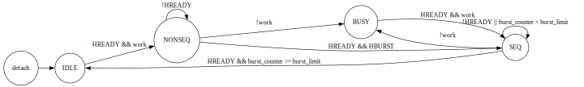

# AHB Master Project Documentation With ALU & REG File Unit

## Table of Contents
1. [About the protocol](#about-the-protocol)
2. [Supported and Unsupported Features](#supported-and-unsupported-features)
3. [Hardware Architecture and FSMs State Diagram](#hardware-architecture-and-fsms-state-diagram)
4. [HDL Coding](#hdl-coding)
5. [Testing (Test Cases and Testbenches)](#testing-test-cases-and-testbenches)
6. [Signal Descriptions](#signal-descriptions)
7. [Downloading & Runing the Simulation](#Downloading-&-Runing-the-Simulation)
8. [dditional Notes](#dditional_Notes)

---
## About the protocol
- AMBA AHB-Lite addresses the requirements of high-performance synthesizable designs.
- It is a bus interface that supports a single bus master and provides high-bandwidth operation.


---
## Supported and Unsupported Features

### Features Covered in the AHB Master ALU and Register File Module

1. **Basic AHB Read and Write Operations**:
   - The module supports standard read and write transactions on the AHB bus. It can initiate read and write operations to and from the AHB bus and interact with a register file internally.

2. **Burst Transactions**:
   - Basic burst transactions (`INCR` type) are supported, allowing the module to handle sequential data transfers. This can optimize throughput when transferring multiple data items.

3. **Register File Interaction**:
   - The module supports reading from and writing to a register file, which is critical for internal data handling. Operations include direct register access and ALU-based processing.

4. **ALU Integration**:
   - An integrated ALU supports basic arithmetic and logical operations, including add, subtract, AND, OR, etc. This allows for data processing within the module before interfacing with the AHB bus or the register file.

5. **Control Signals**:
   - Various control signals (`HWRITE`, `HREADY`, `HRESETn`, `work`) are utilized to manage the state of operations, providing flexibility and robust handling of the AHB interface.

6. **Pipeline Stalling and Execution Control**:
   - The `work` signal can pause and resume operations, effectively controlling the module's activity and allowing for precise timing management in relation to AHB transactions.

7. **Operational Modes**:
   - The module can operate in different modes, such as reading from the AHB bus, performing ALU operations, and then storing or sending results based on control inputs. This flexibility enhances its utility in a variety of AHB-lite based designs.

### Features Not Covered

1. **Multilayer AHB-Lite**:
   - The current implementation does not support a multilayer AHB-Lite architecture, where multiple masters and slaves can communicate over multiple independent layers. This feature is essential for systems requiring simultaneous access to various peripherals.

2. **Protection (HPROT) Signals**:
   - The module does not include handling for the AHB Protection (`HPROT`) signals, which are used to indicate the type of access (privileged, non-privileged, instruction, or data) and provide protection control, crucial for security and access management in complex systems.

3. **Master Lock (HMASTLOCK)**:
   - There is no support for the `HMASTLOCK` signal, which is used in systems requiring locked transactions to prevent other masters from intervening during critical operations. This is important for atomic operations or when accessing shared resources.

4. **Advanced Burst Types (WRAP4, INCR4, WRAP8, INCR8)**:
   - While basic sequential bursts (`INCR`) are supported, more complex burst types like `WRAP4`, `INCR4`, `WRAP8`, and `INCR8` are not implemented. These burst types allow for more efficient use of the AHB bus, especially in cacheable and prefetchable memory regions.


---

## Hardware Architecture and FSMs State Diagram

### Hardware Architecture:
The AHB Master consists of:
- **Control Unit**: FSM responsible for controlling the transaction phases.
- **Data Path**: Handles the transfer of data between the master and the slave.
- **Burst Controller**: Manages bursts, ensuring correct sequence of address increments for burst transfers.
- **CPU Interface**: Connects the master with an external CPU, providing instruction and control information.

### FSM State Diagram:
1. **IDLE State (HTRANS = 2'b00)**: 
   - Default state where no transfers are taking place. The master waits for work from the CPU interface.
   
2. **NONSEQ State (HTRANS = 2'b10)**: 
   - Non-sequential address phase, indicating a new transfer request has started.

3. **SEQ State (HTRANS = 2'b11)**: 
   - Sequential state, where burst transfers take place in sequence without gaps in the address space.

4. **BUSY State (HTRANS = 2'b01)**: 
   - When the master cannot continue transferring but needs to keep the bus occupied.

The FSM transitions based on the availability of work, HREADY signal, and burst conditions.


---

## HDL Coding

### RTL Block Descriptions

#### 1. **AHB Master Block**
   - **Description**: This block is responsible for interfacing with the AHB bus, initiating read and write transactions based on control signals. It generates AHB control signals (`HADDR`, `HTRANS`, `HSIZE`, `HBURST`, `HWRITE`, and `HWDATA`) and handles data transactions (`HRDATA`). The AHB Master manages burst operations and ensures correct timing and protocol adherence.
   - **Key Signals**:
     - `HADDR`: Address for the current AHB transaction.
     - `HTRANS`: Indicates the type of the current transaction (idle, busy, non-sequential, or sequential).
     - `HSIZE`: Specifies the size of the data transfer (byte, half-word, word).
     - `HBURST`: Defines the type of burst transaction (single, incrementing).
     - `HWRITE`: Indicates whether the current transaction is a read or a write.
     - `HWDATA`: Data to be written to the AHB bus.
     - `HRDATA`: Data received from the AHB bus.

#### 2. **ALU Block**
   - **Description**: The ALU performs arithmetic and logical operations on data from the register file. It supports basic operations like addition, subtraction, AND, OR, and others based on the ALU operation code (`AlU_OP`). The result can be written back to the register file or directly to the AHB bus, depending on control signals.
   - **Key Signals**:
     - `AlU_OP`: Operation code that selects the ALU function.
     - `Operand1`, `Operand2`: Inputs to the ALU, typically from the register file.
     - `ALU_Result`: The output of the ALU operation.
     - `ALU_Write`: Control signal to write the ALU result back to the register file.

#### 3. **Register File Block**
   - **Description**: The register file stores and manages registers used by the ALU and the AHB Master. It allows for reading and writing operations based on the addresses and control signals. The register file facilitates data storage and retrieval for subsequent processing.
   - **Key Signals**:
     - `ReadReg1_ADDR`, `ReadReg2_ADDR`: Addresses for the registers to be read.
     - `WriteReg_ADDR`: Address for the register to be written.
     - `ReadData1`, `ReadData2`: Data outputs from the register file.
     - `WriteData`: Data input to be written to the register file.
     - `RegWrite`: Control signal to enable writing to the register file.

#### 4. **Control Unit Block**
   - **Description**: This block manages the overall control flow of the system. It generates the necessary control signals for the AHB Master, ALU, and register file based on the operation mode and input signals. It coordinates the data path and ensures correct sequencing of read, write, and ALU operations.
   - **Key Signals**:
     - `work`: Enables or disables the operation of the module.
     - `HRESETn`: Active-low reset signal to initialize or reset the module.
     - `HREADY`: Indicates the readiness of the bus for a new transaction.
     - `HRESP`: Provides the response status of the current transaction (OKAY, ERROR).

### Code Snippet

Here is a representative snippet of the Verilog code for the `AHB Master ALU REG` module:

```verilog
module AHB_Master_ALU_REG (
    input HCLK,
    input HRESETn,
    input HREADY,
    input HRESP,
    input [31:0] HRDATA,
    input [63:0] cpu_inst, // CPU instruction input combining multiple control signals
    
    output [31:0] HADDR,
    output [2:0] HBURST,
    output [2:0] HSIZE,
    output [1:0] HTRANS,
    output [31:0] HWDATA,
    output HWRITE
);

    // Internal signal declarations
    wire [2:0] ReadReg1_ADDR = cpu_inst[21:19];
    wire [2:0] ReadReg2_ADDR = cpu_inst[24:22];
    wire [2:0] WriteReg_ADDR = cpu_inst[27:25];
    wire [2:0] AlU_OP = cpu_inst[30:28];
    wire [31:0] HADDRin = cpu_inst[63:32];
    wire [2:0] HSIZEin = cpu_inst[6:4];
    wire HWRITEin = cpu_inst[0];
    wire [2:0] HBURSTin = cpu_inst[3:1];
    wire work = cpu_inst[7];
    wire [7:0] burst_length = cpu_inst[15:8];
    wire read_write = cpu_inst[31];
    wire Register = cpu_inst[18];
    
    // Example of AHB Address generation logic
    assign HADDR = HADDRin;
    assign HBURST = HBURSTin;
    assign HSIZE = HSIZEin;
    assign HWRITE = HWRITEin;

    // Further logic to handle ALU operations, register file reads/writes, and AHB data transactions...
    
    // Control logic for transaction type based on inputs and operation mode
    always @ (posedge HCLK or negedge HRESETn) begin
        if (!HRESETn) begin
            // Reset conditions
            // ...
        end else if (work && HREADY) begin
            // Perform read, write, or ALU operation based on control inputs
            // ...
        end
    end

    // Include logic for ALU operations, register interactions, AHB transactions, etc.
    // ...

endmodule
```

---
## Testing (Test Cases and Testbenches)

The testbench (`AHB_Master_ALU_REG_TB`) verifies the functionality of the AHB Master ALU and Register File module by simulating various operational scenarios. Each test case is designed to evaluate a specific feature or behavior of the module, ensuring it adheres to the expected functionality.

### Test Cases

#### Test Case 1: Basic Read and Store in the Register
- **Description**: Tests reading data from the AHB bus and storing it in register address 0.
- **Setup**: 
  - `HWRITEin = 1`: Indicates a write operation.
  - `ReadReg1_ADDR = 0`: Read from register 0.
  - `WriteReg_ADDR = 0`: Write to register 0.
  - `HRDATA = 10`: Mock data received from AHB bus.
- **Expected Behavior**: Data (`10`) should be stored in register 0 after the transaction.

#### Test Case 2: Sending Previously Stored Data
- **Description**: Tests sending the data that was previously stored in register 0.
- **Setup**: 
  - `HWRITEin = 0`: Indicates a read operation.
  - `read_write = 1`: Indicates that data should be sent.
  - `ReadReg1_ADDR = 0`: Send data from register 0.
- **Expected Behavior**: The value (`10`) stored in register 0 should be sent on the AHB bus.

#### Test Case 3: Store in a Different Register
- **Description**: Tests writing data to a different register address (register 1).
- **Setup**: 
  - `HWRITEin = 1`: Write operation.
  - `WriteReg_ADDR = 1`: Target register address 1.
  - `HRDATA = 15`: New mock data from AHB bus.
- **Expected Behavior**: Data (`15`) should be written to register 1.

#### Test Case 4: ALU Operation and Store in Register
- **Description**: Tests performing an ALU operation (e.g., subtraction) and storing the result in a register.
- **Setup**: 
  - `AlU_OP = 6`: Subtract operation.
  - `ReadReg1_ADDR = 0`, `ReadReg2_ADDR = 1`: Read from registers 0 and 1.
  - `WriteReg_ADDR = 2`: Write the result to register 2.
- **Expected Behavior**: The ALU performs the operation (`0 - 15 = -15`), and the result is stored in register 2.

#### Test Case 5: ALU Operation and Send
- **Description**: Performs an ALU operation and sends the result directly to the AHB bus.
- **Setup**: 
  - `HWRITEin = 0`: Indicates a read operation.
  - `read_write = 0`: Indicates data should be sent.
  - `Register = 1`: Select ALU operation to send.
- **Expected Behavior**: The ALU result from the previous operation (`-15`) should be sent on the AHB bus.

#### Test Case 6: Send Stored Data from Different Register
- **Description**: Tests sending data stored in register 2, which was the result of an ALU operation.
- **Setup**: 
  - `ReadReg1_ADDR = 2`: Send data from register 2.
- **Expected Behavior**: Data (`-15`) from register 2 should be sent on the AHB bus.

#### Test Case 7: Check HREADY Behavior
- **Description**: Verifies behavior when `HREADY` is de-asserted (0), simulating a busy state.
- **Setup**: 
  - `HREADY = 0`: AHB is busy, no operations should proceed.
- **Expected Behavior**: Module should wait and not perform transactions until `HREADY` is asserted again.

#### Test Case 8: Reset Check
- **Description**: Verifies correct reset behavior of the module.
- **Setup**: 
  - `HRESETn = 0`: Apply reset.
  - `HRESETn = 1`: Release reset.
- **Expected Behavior**: All internal states should be reset, registers cleared.

#### Test Case 9: Work Signal Control
- **Description**: Tests the `work` signal to control module operation.
- **Setup**: 
  - `work = 0`: Pauses operation.
  - `work = 1`: Resumes operation.
- **Expected Behavior**: Operations should pause and then resume as per the `work` signal state.

#### Test Case 10: AHB Burst Operation
- **Description**: Tests handling of burst transactions on the AHB bus.
- **Setup**: 
  - `HBURSTin = 1`: Sequential burst.
  - `burst_length = 3`: Indicates the length of the burst.
- **Expected Behavior**: Module should correctly handle burst operations over multiple cycles.

**All cases were successful**


**Wave Form For Register File  & ALU Send & Receive Data Pipelined** 


**Wave Form For Burst Send Data Pipelined** 


---
## Signal Descriptions

| **Signal**      | **Direction** | **Width** | **Description**                                                                                               |
|-----------------|---------------|-----------|---------------------------------------------------------------------------------------------------------------|
| `HCLK`          | Input         | 1         | AHB Clock Signal.                                                                                            |
| `HRESETn`       | Input         | 1         | Active-low Reset Signal. Resets the internal state of the module.                                            |
| `HREADY`        | Input         | 1         | AHB Ready Signal. Indicates if the bus is ready for new transactions.                                        |
| `HRESP`         | Input         | 1         | AHB Response Signal. Shows error responses from the slave (OKAY or ERROR).                                    |
| `HRDATA`        | Input         | 32        | Data from the AHB bus to the master.                                                                         |
| `ReadReg1_ADDR` | Input         | 3         | Address of the first register to read from in the register file.                                             |
| `ReadReg2_ADDR` | Input         | 3         | Address of the second register to read from in the register file.                                            |
| `WriteReg_ADDR` | Input         | 3         | Address of the register to write to in the register file.                                                    |
| `AlU_OP`        | Input         | 3         | ALU operation code (e.g., add, subtract, AND, OR, etc.).                                                     |
| `HADDRin`       | Input         | 32        | Address input for AHB transactions.                                                                          |
| `HSIZEin`       | Input         | 3         | Transfer size (in bytes) for AHB transactions.                                                              |
| `HWRITEin`      | Input         | 1         | Write enable signal for AHB transactions.                                                                   |
| `HBURSTin`      | Input         | 3         | Burst type for AHB transactions.                                                                             |
| `work`          | Input         | 1         | Operation enable signal; pauses module when low.                                                            |
| `burst_length`  | Input         | 8         | Number of transfers in a burst operation.                                                                   |
| `read_write`    | Input         | 1         | Indicates whether the operation is a read (0) or write (1).                                                 |
| `Register`      | Input         | 1         | Indicates whether the operation is on registers (1) or directly on the AHB bus (0).                         |
| `HADDR`         | Output        | 32        | AHB address output.                                                                                         |
| `HBURST`        | Output        | 3         | AHB burst type output.                                                                                      |
| `HSIZE`         | Output        | 3         | AHB size output.                                                                                            |
| `HTRANS`        | Output        | 2         | AHB transfer type (IDLE, BUSY, NONSEQ, SEQ).                                                               |
| `HWDATA`        | Output        | 32        | Data from the master to the AHB bus.                                                                        |
| `HWRITE`        | Output        | 1         | AHB write signal; indicates if the current transaction is a write.                                          |
| `rg_wr`         | Output        | 1         | Register write enable; controls writing to the register file.                                               |
| `refi`          | Output        | 32        | Register file data output; shows the current value of register 0 for debugging.                             |
| `ins`           | Output        | 32        | Current instruction input to the CPU, used to control operations within the module.                        |
| `reg_write`     | Output        | 1         | Indicates a register write operation in progress.                                                          |
| `type_data`     | Output        | 1         | Indicates whether the data is of a specific type (ALU vs register).                                         |

---


### Detailed Descriptions:

- **HCLK**: The main clock signal that drives the timing of the AHB Master module.
- **HRESETn**: An active-low reset signal that initializes or resets the state of the AHB Master module.
- **HADDR**: Carries the memory address for read/write transactions initiated by the master and the firet 2 bits select the slave.
- **HBURST**: Specifies the type of burst transaction, such as single, incremental (INCR), or wrapped (WRAP).
- **HSIZE**: Indicates the size of the data for the current transaction (e.g., 4 bytes for 32-bit data).
- **HTRANS**: Defines the type of transfer, including IDLE, BUSY, NON-SEQ (non-sequential), and SEQ (sequential).
- **HWDATA**: The data to be written to the slave during write transactions.
- **HWRITE**: Signals whether the current operation is a write (`1`) or a read (`0`).
- **HRDATA**: The data read from the slave during read transactions.
- **HREADY**: Indicates if the slave is ready to accept the next transaction or is still processing the current one.
- **HRESP**: Provides feedback from the slave, where `1` indicates an error and `0` indicates success.
- **cpu_inst**: Contains both the address (upper 32 bits) and data (lower 32 bits) from the CPU for the current operation.
- **cpu_cont**: Control signals from the CPU that include burst size, data size, and the direction of the transfer (read or write).
- **num_beats**: Number of beats that the CPU will send to the master and it only needed in Incrementing burst of undefined length.


---

## Downloading & Runing the Simulation

### Downloading the Repository
 To download the testbench and associated files, follow these steps:

1. Clone the repository from GitHub:

``` git clone https://github.com/mgma10/ahb_master_project.git ```

2. Navigate to the project directory:

``` cd ahb_master_project ```

### Running the Simulation
The simulation can be run using the run.do script provided in the repository. This script automates the compilation and simulation process.

1. Open your simulation tool (e.g., ModelSim).

3. Load the run.do script:

#### bash
```do run.do```

3. The script will compile the testbench and run the simulation. You can view the results in the waveform window.

---

## Additional Notes

- **Internal and External Process**:
  - The current architecture keeps the ALU operations and AHB transactions largely independent, which simplifies the design but may not fully exploit the potential of a tightly integrated system where the ALU could directly write to the AHB bus and vice versa.

