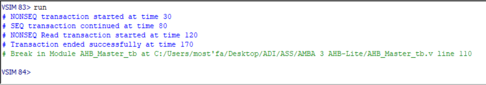
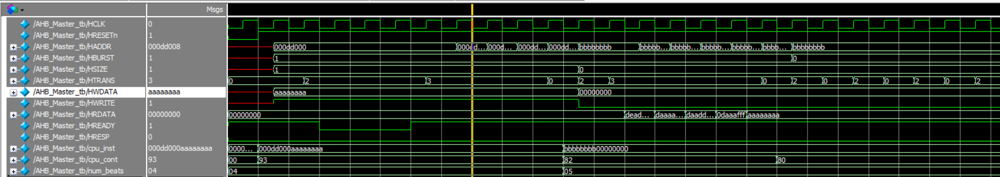

# AHB Master Project Documentation

## Table of Contents
1. [About the protocol](#about-the-protocol)
2. [Supported and Unsupported Features](#supported-and-unsupported-features)
3. [Hardware Architecture and FSMs State Diagram](#hardware-architecture-and-fsms-state-diagram)
4. [HDL Coding](#hdl-coding)
5. [Testing (Test Cases and Testbenches)](#testing-test-cases-and-testbenches)
6. [Signal Descriptions](#signal-descriptions)
7. [Downloading & Runing the Simulation](#Downloading-&-Runing-the-Simulation)

---
## About the protocol
- AMBA AHB-Lite addresses the requirements of high-performance synthesizable designs.
- It is a bus interface that supports a single bus master and provides high-bandwidth operation.


---
## Supported and Unsupported Features

### Supported Features:
- Implements AHB-Lite Master functionality, capable of generating both read and write transactions.
- Supports burst modes of operation:
  - INCR: Incremental bursts where addresses increase sequentially.
  - SINGLE: Single data transfer.
- Data widths of 32 bits supported.
- State transitions for different types of transactions (IDLE, NONSEQ, SEQ, and BUSY) are implemented.

### Unsupported Features:
- Advanced burst types such as WRAP are not supported in this module.
- No support for split, retry, or error handling mechanisms.
- Only HSIZE values supporting 4-byte transfers (word size) are implemented.
- Does not support multi-layer AHB implementations.

---

## Hardware Architecture and FSMs State Diagram

### Hardware Architecture:
The AHB Master consists of:
- **Control Unit**: FSM responsible for controlling the transaction phases.
- **Data Path**: Handles the transfer of data between the master and the slave.
- **Burst Controller**: Manages bursts, ensuring correct sequence of address increments for burst transfers.
- **CPU Interface**: Connects the master with an external CPU, providing instruction and control information.

### FSM State Diagram:
1. **IDLE State (HTRANS = 2'b00)**: 
   - Default state where no transfers are taking place. The master waits for work from the CPU interface.
   
2. **NONSEQ State (HTRANS = 2'b10)**: 
   - Non-sequential address phase, indicating a new transfer request has started.

3. **SEQ State (HTRANS = 2'b11)**: 
   - Sequential state, where burst transfers take place in sequence without gaps in the address space.

4. **BUSY State (HTRANS = 2'b01)**: 
   - When the master cannot continue transferring but needs to keep the bus occupied.

The FSM transitions based on the availability of work, HREADY signal, and burst conditions.


---

## HDL Coding

The module is written in Verilog HDL, implementing AHB Master logic as per the AHB-Lite protocol.

### Key RTL Components:
- **HTRANS Generation**: The FSM drives the HTRANS signal based on transaction phases.
- **Data Path**: Handles input/output data from the CPU and writes/reads to/from the AHB slave.

### Code Snippet:
```verilog
always @(posedge HCLK or negedge HRESETn) begin
    if (!HRESETn)
    begin   
        HTRANS <= IDLE;   
    end
    else
    begin
        case (HTRANS)
            IDLE:begin
                HADDR <= cpu_inst[63:32];
                HWDATA <= cpu_inst[31:0];
                HSIZE <= cpu_cont[6:4];  
                HWRITE <= cpu_cont[0];   
                HBURST <= cpu_cont[3:1];
                work <= cpu_cont[7];
                if (HREADY && work) begin
                    HTRANS <= NONSEQ;
                    burst_counter <= 0;        
                end
            end
            BUSY:begin
                if (HREADY && work) begin
                    HTRANS <= SEQ; 
                end
            end
            NONSEQ:begin
                if (HREADY) begin
                    if (!work)
                    HTRANS <= BUSY;
                    else if (HBURST) begin
                        HWDATA <= cpu_inst[31:0];
                        burst_counter <= burst_counter + 1;
                        HTRANS <= SEQ;
                    end else begin
                        HTRANS <= IDLE;
                        HWDATA <= cpu_inst[31:0];
                    end
                end
            end
            SEQ:begin
                if (HREADY) begin
                    HWDATA <= cpu_inst[31:0];
                    HADDR <= HADDR + (4 << HSIZE); 
                        burst_counter <= burst_counter + 1;
                    if (!work)
                    HTRANS <= BUSY;
                    else if(HBURST == 3'b001 && burst_counter < 8'b11111111)
                        HTRANS <= SEQ;

                    else if(HBURST == 3'b010 && burst_counter < 4)
                            HTRANS <= SEQ;

                    else if(HBURST == 3'b011 && burst_counter < 4)
                        HTRANS <= SEQ;

                    else if(HBURST == 3'b100 && burst_counter < 8)
                            HTRANS <= SEQ;

                    else if(HBURST == 3'b101 && burst_counter < 8)
                            HTRANS <= SEQ;

                    else if(HBURST == 3'b110 && burst_counter < 16)
                            HTRANS <= SEQ;

                    else if(HBURST == 3'b111 && burst_counter < 16)
                            HTRANS <= SEQ; 

                        else begin
                        HTRANS <= IDLE;
                    end
                end  
            end
            default:HTRANS <= IDLE;
        endcase
    end
end

```
---
## Testing (Test Cases and Testbenches)

The `AHB_Master_tb` testbench is designed to verify the functionality of the `AHB_Master` module by simulating various AHB-Lite transactions. This includes both read and write operations, handling of burst transfers, and appropriate state transitions within the finite state machine (FSM).

## Testbench Description

The testbench instantiates the `AHB_Master` module and drives its inputs to simulate different operational scenarios. It checks the outputs and internal state transitions to ensure that the `AHB_Master` behaves as expected under various conditions.

**Procedure:**  
- Apply a reset (`HRESETn = 0`) and then release it (`HRESETn = 1`).
- Check the initial state of `HTRANS` and other control signals.

**Expected Result:**  
- `HTRANS` should be set to IDLE (`2'b00`).

### 2. Write Transaction (Incrementing Burst)

**Objective:**  
Test the write operation in an incrementing burst mode.

**Procedure:**  
- Set `cpu_inst` to initiate a write to address `0xAAAAAAAA` with data `0x00000000`.
- Configure `cpu_cont` for a 4-byte incrementing burst (`HBURST = INCR`), size 4-byte (`HSIZE = 3'b010`), and set `HWRITE` high.
- Assert `HREADY` and observe state transitions.

**Expected Results:**  
- `HTRANS` should transition from IDLE to NONSEQ (`2'b10`), and then to SEQ (`2'b11`) for the burst continuation.
- The address should increment correctly for each beat of the burst.

### 3. Handling Slave Busy Signal

**Objective:**  
Verify that the FSM correctly handles a busy slave by waiting on `HREADY`.

**Procedure:**  
- During a burst write, set `HREADY = 0` to simulate a busy slave.
- Observe the behavior of `HTRANS` and ensure it waits properly.

**Expected Results:**  
- `HTRANS` should not advance to the next state while `HREADY = 0`.
- Once `HREADY` returns to 1, the FSM should continue to SEQ state as expected.

### 4. Read Transaction (Single Transfer)

**Objective:**  
Verify a read operation with a single transfer type.

**Procedure:**  
- Set `cpu_inst` to address `0xBBBBBBBB` with no data (read operation).
- Configure `cpu_cont` for a single read transfer (`HBURST = SINGLE`) and set `HWRITE` low.
- Simulate valid read data from the slave on `HRDATA`.

**Expected Results:**  
- `HTRANS` should transition to NONSEQ (`2'b10`) for the read operation.
- The correct data should be captured when `HREADY = 1`.

**All cases were successful**



**Wave Form** 


---
## Signal Descriptions

| Signal Name  | Width   | Direction | Description                                                   |
|--------------|---------|-----------|---------------------------------------------------------------|
| **HCLK**     | 1       | Input     | Clock signal for the module.                                  |
| **HRESETn**  | 1       | Input     | Active-low reset signal to initialize the module.              |
| **HADDR**    | 32      | Output    | Address of the transaction being initiated by the master.      |
| **HBURST**   | 3       | Output    | Burst type of the transaction (SINGLE, INCR, WRAP).            |
| **HSIZE**    | 3       | Output    | Indicates the size of the data being transferred.              |
| **HTRANS**   | 2       | Output    | Indicates the type of transfer (IDLE, BUSY, NONSEQ, SEQ).      |
| **HWDATA**   | 32      | Output    | Data to be written to the slave during a write transaction.    |
| **HWRITE**   | 1       | Output    | Indicates whether the current transfer is a write (1) or read (0). |
| **HRDATA**   | 32      | Input     | Data read from the slave during a read transaction.            |
| **HREADY**   | 1       | Input     | Indicates whether the slave is ready to proceed with the transaction. |
| **HRESP**    | 1       | Input     | Indicates an error (1) or OK (0) response from the slave.      |
| **cpu_inst** | 64      | Input     | Contains the instruction from the CPU (address and data).      |
| **cpu_cont** | 8       | Input     | Control signals from the CPU (size, burst, work).              |

### Detailed Descriptions:

- **HCLK**: The main clock signal that drives the timing of the AHB Master module.
- **HRESETn**: An active-low reset signal that initializes or resets the state of the AHB Master module.
- **HADDR**: Carries the memory address for read/write transactions initiated by the master and the firet 2 bits select the slave.
- **HBURST**: Specifies the type of burst transaction, such as single, incremental (INCR), or wrapped (WRAP).
- **HSIZE**: Indicates the size of the data for the current transaction (e.g., 4 bytes for 32-bit data).
- **HTRANS**: Defines the type of transfer, including IDLE, BUSY, NON-SEQ (non-sequential), and SEQ (sequential).
- **HWDATA**: The data to be written to the slave during write transactions.
- **HWRITE**: Signals whether the current operation is a write (`1`) or a read (`0`).
- **HRDATA**: The data read from the slave during read transactions.
- **HREADY**: Indicates if the slave is ready to accept the next transaction or is still processing the current one.
- **HRESP**: Provides feedback from the slave, where `1` indicates an error and `0` indicates success.
- **cpu_inst**: Contains both the address (upper 32 bits) and data (lower 32 bits) from the CPU for the current operation.
- **cpu_cont**: Control signals from the CPU that include burst size, data size, and the direction of the transfer (read or write).


---

## Downloading & Runing the Simulation

### Downloading the Repository
 To download the testbench and associated files, follow these steps:

1. Clone the repository from GitHub:

``` git clone https://github.com/mgma10/ahb_master_project.git ```

2. Navigate to the project directory:

``` cd ahb_master_project ```

### Running the Simulation
The simulation can be run using the run.do script provided in the repository. This script automates the compilation and simulation process.

1. Open your simulation tool (e.g., ModelSim).

3. Load the run.do script:

#### bash
```do run.do```

3. The script will compile the testbench and run the simulation. You can view the results in the waveform window.